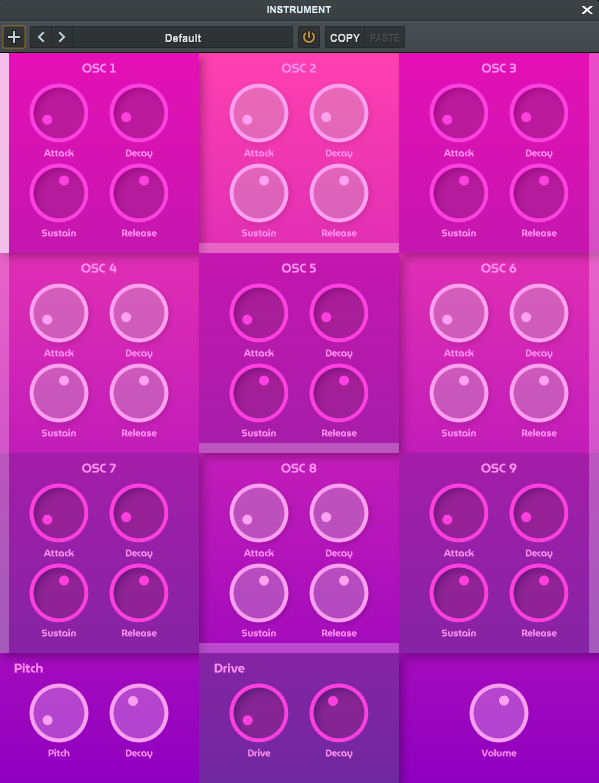

<h1>Fusion</h2>



<br>

<p>
    Fusion is an additive synthesizer with 9 oscillators, each linked to the harmonic series, featuring pitch and drive envelopes for precise sound control.
</p>

## Installation
### VST3 Installation (Windows)

1. **Download the Plugin:** Download fusion.vst3 from [releases](https://github.com/enter-opy/fusion/releases).

2. **Install the Plugin:**
   - **Copy the file into your DAW's plugin directory.**
   - **Rescan Plugins:** Follow your DAW's instructions to rescan plugins or manually add the plugin if necessary.

### Build from Source
To build Fusion from source:

1. **Clone the Repository:**
   ```bash
   git clone https://github.com/enter-opy/fusion.git
   cd fusion
2. **Install Dependencies:**
   - **Windows:** Make sure you have Visual Studio installed with the necessary components for C++ development.
   - **Mac:** Make sure you have Xcode installed with the command line tools.

   Add [Maximilian](https://github.com/enter-opy/fusion/tree/main/Maximilian) to Header Search Paths.
3. **Build the Plugin:**

   **Windows:**
   - Open the project in Visual Studio.
   - Set the build configuration to `Release`.
   - Build the project by selecting `Build > Build Solution`.

   **Mac:**
   - Open the project in Xcode.
   - Set the scheme to `Release`.
   - Build the project by selecting `Product > Build`.
## Usage
- **Insert Plugin:** Load Sound of music plugin into your preferred digital audio workstation (DAW).
- **Adjust Oscillator parameters:**

    There are 9 oscillators, OSC1 to OSC9, each producing a single sine wave with a frequency of \(f_n\) Hz where \(n\) is the oscillator number.

   

   - **Attack:** Set the attack time (ms) of the oscillator.
   - **Decat:** Set the decay time (ms) of the oscillator.
   - **Sustain:** Set the sustain value (%) of the oscillator.
   - **Release:** Set the release time (ms) of the oscillator.
   - **Level:** Adjust the bar slider to control the level of the oscillator.

- **Adjust Effects Envelopes:**

   

   - **Pitch Envelope:**
      - **Pitch:** Control the amount of pitch modulation.
      - **Decay:** Set the decay time (ms) of the pitch envelope.
   - **Drive Envelope:**
      - **Pitch:** Control the amount of Drive modulation.
      - **Decay:** Set the decay time (ms) of the pitch envelope.
- **Adjust Output Volume:**
  - **Volume:** Controls the output gain.

## Contributing
Contributions to Sound of music are welcome! If you'd like to contribute, follow these steps:
1. **Fork the Repository:** Start by forking the [Fusion repository](https://github.com/enter-opy/fusion).
2. **Make Changes:** Create a new branch, make your changes, and commit them to your branch.
3. **Create a Pull Request:** Push your changes to your fork and submit a pull request to the original repository.
## License
This project is licensed under the GNU General Public License. See the [LICENSE](https://github.com/enter-opy/fusion/blob/main/LICENSE) for details.